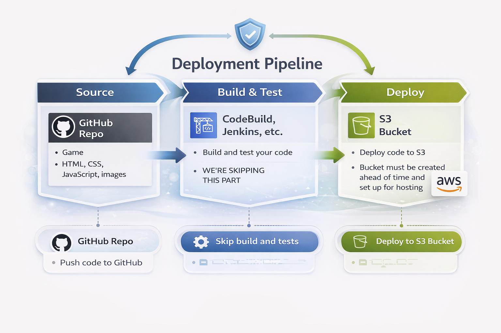

# Images Matching Game

A clean, responsive memory game built with HTML, CSS, and JavaScript. Flip two cards at a time and match all the image pairs.

## Features
- Lightweight static site (no build step)
- Responsive layout for desktop and mobile
- Simple, fast gameplay loop

## Tech Stack
- HTML
- CSS
- JavaScript

## Run Locally
1. Open `index.html` in a browser.

## Demo Video
Watch the full walkthrough: 

## Deploy
For an AWS S3 + CodePipeline deployment guide, see `DEPLOYMENT_AWS.md`.

## Project Structure
- `index.html` - UI markup
- `styles.css` - UI styling
- `script.js` - game logic
- `images/` - game images
- `image.png` - project screenshot
